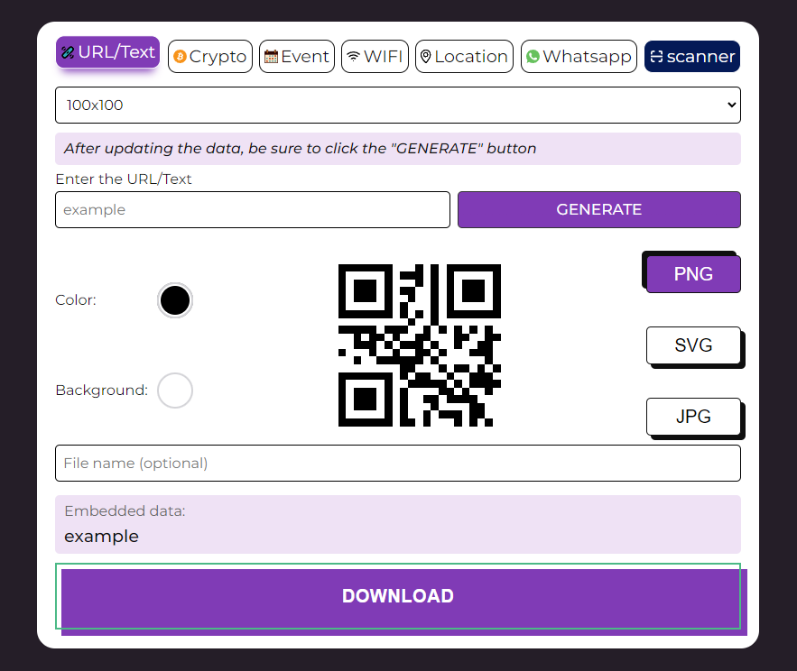

# QR Code Generator

***

## Overview
QR Code Generator is a web application that allows users to create QR codes for various types of data such as URLs, crypto addresses, events, WiFi credentials, locations, and WhatsApp messages.
This project is a simple QR code generator built using HTML, SCSS, and JavaScript. It offers a user-friendly interface to generate QR codes for different purposes.

***

## Usage
1. Choose the type of data you want to encode by clicking on the corresponding button (URL/Text, Crypto, Event, WiFi, Location, WhatsApp).
2. Enter the required data in the form fields.
3. Customize the QR code size and format using the dropdown menus.
4. Click the "Generate" button to create the QR code.
5. Download the generated QR code by clicking the "Download" button.

***

## Screenshot 

***

## QR Code Functionality

### URL QR Code
- Allows users to input a URL or text.
- Generates a QR code based on the entered data.
- Displays the generated QR code along with the input data.

### Crypto QR Code
- Enables users to select a cryptocurrency.
- Accepts an address and specifies an amount.
- Generates a QR code containing cryptocurrency, address, and amount information.
- Displays the generated QR code along with the formatted data.

### Event QR Code
- Lets users input event details like description, start date, and end date.
- Generates a QR code for the event with the specified details.
- Displays the generated QR code along with the event data.

### WiFi QR Code
- Allows users to input WiFi network details including SSID, encryption type, and password.
- Generates a QR code for connecting to the WiFi network.
- Displays the generated QR code along with the formatted network data.

### Location QR Code
- Accepts latitude and longitude coordinates for a location.
- Generates a QR code with a link to Google Maps for the specified location.
- Displays the generated QR code along with the location data.

### WhatsApp QR Code
- Permits users to input a telephone number and a message for WhatsApp.
- Generates a QR code with a link to send a message on WhatsApp to the specified number.
- Displays the generated QR code along with the formatted WhatsApp message link.